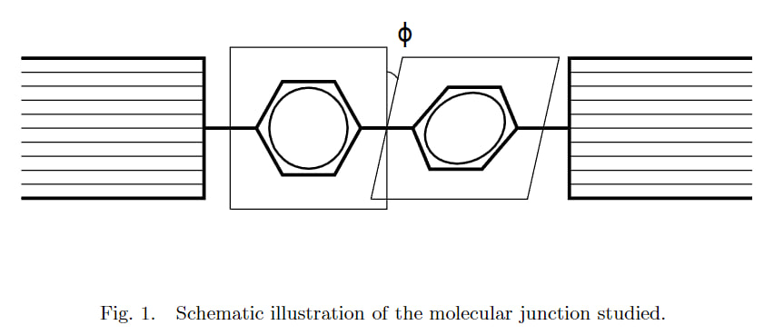

# Conversion of a Molecules Form from Left Handed to Right Handed Form through Electron Collision
The "Conversion of Molecules from Left Handed to Right Handed Form Through Electron Collision" project focuses on studying the impact of electron collision on the orientation of a junction of two Biphenyl molecules.



## Installation  
1. Clone git repo
```sh
git clone https://github.com/ArtDoctor/Conversion-of-a-Molecules-Form-from-Left-Handed-to-Right-Handed-through-Electron-Collision/tree/main
```
2. Create Python venv
```sh
python -m venv venv
source venv/bin/activate
```
or in Windows:
```sh
.\.venv\Scripts\activate
```
3. Install Python packages
```sh
pip install -r requirements.txt
```
Using this venv all notebooks should run withour errors.


## Current progress  
- [x] Solve Schrodinger Equation using FDM
- [ ] ***Solve Schrodinger Equation using Exponential Fourier Basis***
- [ ] ***Solve Schrodinger Equation using Sines and Cosines Fourier Basis***
- [x] Check patterns of wave function eigenvalues at higher energies
- [x] Check delta splitting for energy eigenvalues for every group of 4 eigenstates, try to improve accuracy
- [ ] ***Reproduce main reference paper till the checkpoint - reproduce graphs (Energy dependence of the averaged transmission probability (see text) for three coupling strengths α and temperature T = 0.)***
- [ ] Try trapezoidal integration instead of standard numpy integration
- [ ] Improve FDM accuracy by using corner matrix elements  
Selected steps are currently in progress.

## Main references:  
<a href="https://arxiv.org/abs/cond-mat/0411064"><strong>Charge transport through a flexible molecular junction</strong></a>
<a href="https://arxiv.org/abs/cond-mat/0312080">Theory of Vibrationally Inelastic Electron Transport through Molecular Bridges</strong></a>
